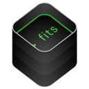

<p align="center">

</p>

<p align="center">
<a href="LICENSE">

</a>
<a href="https://swift.org">

</a>
</p>

A simple commad line tool to read FITS files

## Description

FITSTool is a command line tool to read, manipulate and write files conforming to the [FITS 4.0](https://fits.gsfc.nasa.gov/fits_standard.html) file format, commonly used to store astronomical data. 

|  |  |  |
| :---------------------------------------: | :---------------------------------------: | :---------------------------------------: | 
| [**FITSCore**](https://github.com/brampf/fitscore) | [**FITSKit**](https://github.com/brampf/fitskit) | [**FITSTool**](https://github.com/brampf/fitstool) |
|  Fits file format read & write  | Image rendering & manipulation | Command line tool |
|  macOS, iOS & Linux | iOS / macCatalyst | Linux |

## Documentation

### Usage

```
OVERVIEW: A Swift command-line tool to read FITS files

USAGE: fits-tool <path> [--hdu <hdu>] [--verbose] [-l]

ARGUMENTS:
<path>                  The path to the file 

OPTIONS:
--hdu <hdu>             Examine a specific HDU 
-v, --verbose           Show extra logging for debugging purposes 
-l                      Show list of hdus 
--version               Show the version.
-h, --help              Show help information.

```

## License

MIT license; see [LICENSE](LICENSE.md).
(c) 2020
